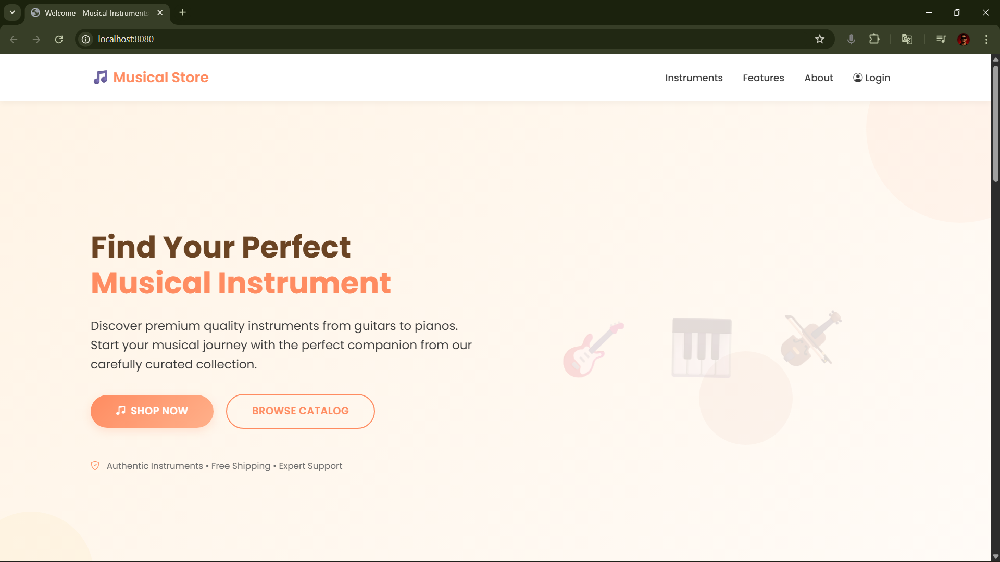
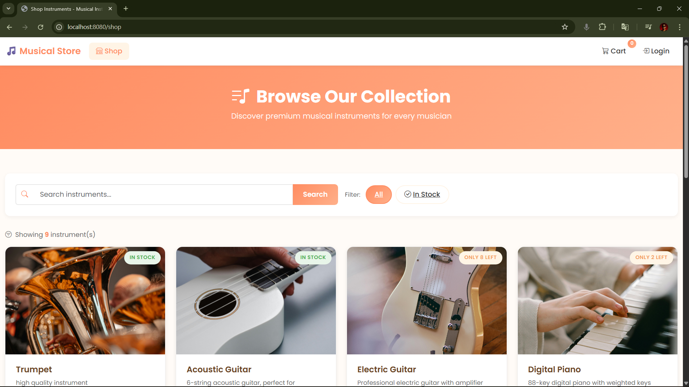
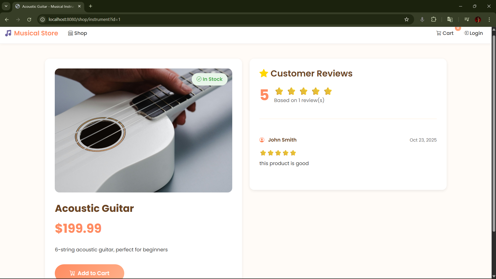
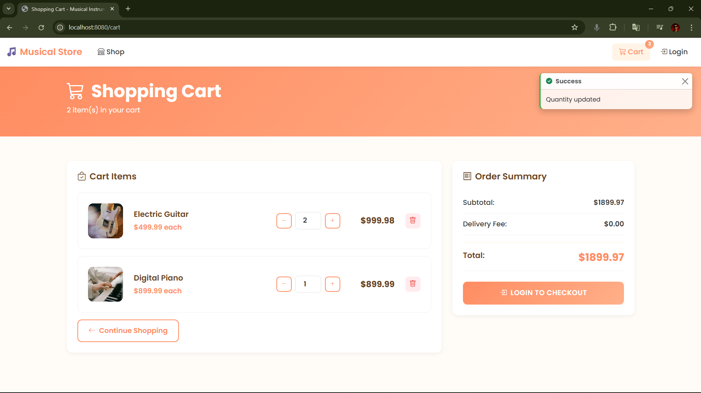
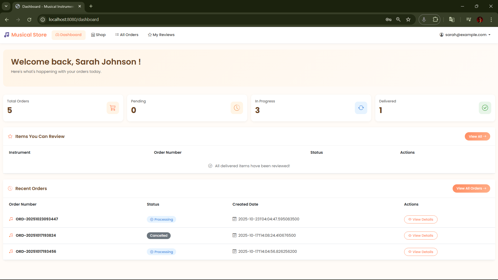
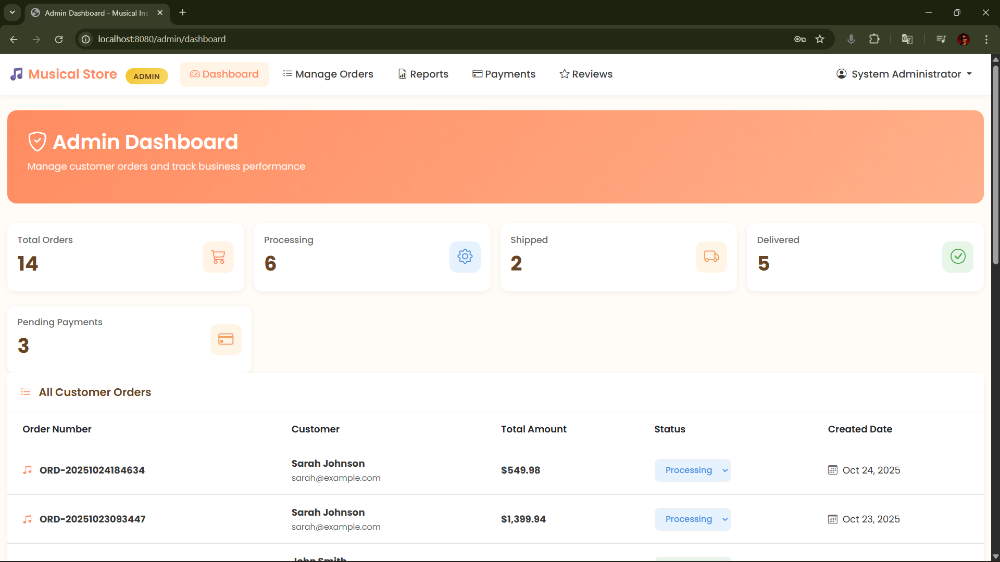
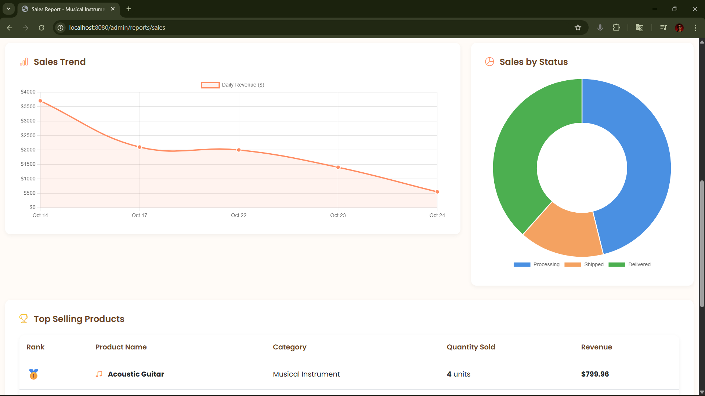
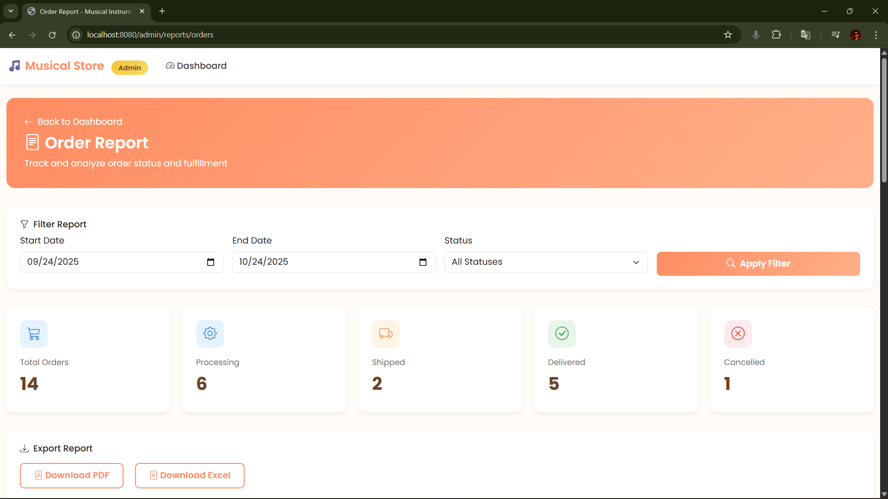
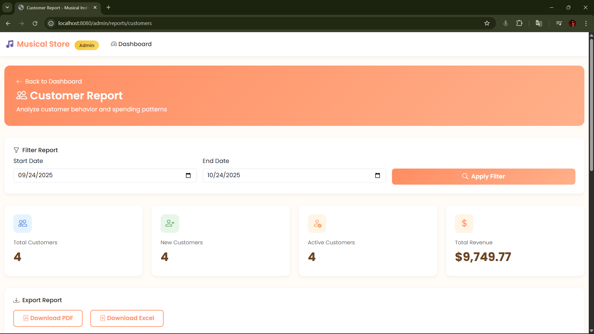
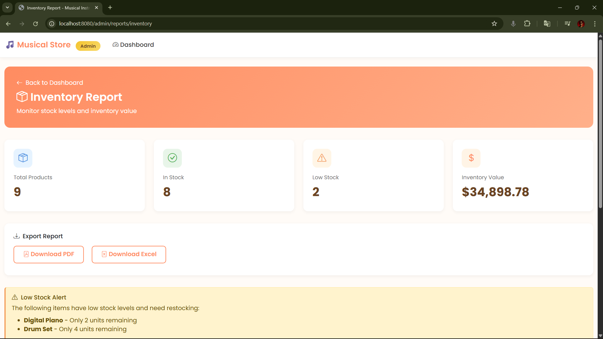

# Music Instrumental Selling System

A comprehensive web-based e-commerce platform for selling musical instruments, built with Jakarta EE and SQL Server.

---

## Academic Information

**Institution:** Sri Lanka Institute of Information Technology (SLIIT)  
**Course:** SE2030 - Software Engineering  
**Academic Year:** Year 2, Semester 1, 2025  
**Student:** Kalhara K.V (IT24104383)

---

## Overview

The Music Instrumental Selling System is a full-stack web application designed to facilitate the online purchase of musical instruments. The system provides separate interfaces for customers and administrators, enabling seamless product browsing, cart management, order processing, and comprehensive business analytics.

---

## Features

### Customer Features
- User registration and authentication
- Browse musical instruments catalog with images
- Search and filter products
- Shopping cart management
- Order placement and tracking
- Responsive UI design
- Product reviews and ratings

### Admin Features
- Comprehensive dashboard with statistics
- Order management and status updates
- Payment verification
- Report generation (Sales, Orders, Customers, Inventory)
- Export reports to PDF and Excel
- Visual analytics with charts

### System Features
- Role-based access control (Admin/Customer)
- Database connection pooling with HikariCP
- Bootstrap 5 responsive design
- Chart.js data visualization
- Secure password hashing with BCrypt

---

## Technologies Used

### Backend
- Jakarta EE 9+ (Servlet 6.0, JSP, JSTL 3.0)
- Java 17
- SQL Server 2022
- HikariCP (Connection pooling)

### Frontend
- Bootstrap 5.3
- Chart.js 4.4
- Bootstrap Icons
- Vanilla JavaScript

### Report Generation
- Apache POI 5.2.5 (Excel)
- iText 5.5.13 (PDF)

### Build & Deployment
- Apache Maven 3.x
- Apache Tomcat 10.1.x

---

## System Architecture

**MVC (Model-View-Controller) Pattern**
- Client (Browser/JSP) -> Controller (Servlets) -> Model (Java Beans) -> Database (SQL Server)

---

## Database Schema

### Main Tables
- **app_user** - User accounts (Admin/Customer)
- **instrument** - Musical instruments catalog
- **customer_order** - Customer orders
- **order_item** - Order line items
- **payment** - Payment records
- **product_feedback** - Product reviews

---

## Key Functionalities

### 1. Authentication & Authorization
- Secure login with BCrypt password hashing
- Role-based access control (Admin/Customer)
- Session management

### 2. Product Catalog Management
- Browse instruments with product images
- Search functionality
- Filter by stock availability
- Detailed product view with descriptions

### 3. Shopping Cart
- Add/remove items
- Update quantities
- Real-time price calculation
- Session-based cart storage

### 4. Order Processing
- Multi-step checkout process
- Order confirmation
- Order tracking
- Order history for customers

### 5. Admin Dashboard
- Real-time statistics (orders, revenue, customers)
- Order management with status updates
- Visual data representation with charts
- Payment verification

### 6. Report Generation System

**Sales Report**
- Total revenue analysis
- Top-selling products
- Sales trend visualization
- Export to PDF/Excel

**Order Report**
- Order status breakdown
- Daily order trends
- Detailed order lists
- Export functionality

**Customer Report**
- Customer count and growth
- Top customers by spending
- Purchase pattern analysis

**Inventory Report**
- Stock level monitoring
- Low stock alerts
- Inventory valuation
- Product-wise stock details

### 7. Additional Features
- Product reviews and ratings
- Payment tracking and verification
- Responsive design for all devices
- Image management for products

---

## Screenshots

### Customer Interface

#### Homepage

*Landing page with featured instruments and easy navigation*

#### Shop Page

*Browse complete catalog with search and filter capabilities*

#### Product Details

*Detailed instrument view with specifications and pricing*

#### Shopping Cart

*Manage cart items and proceed to checkout*

#### Customer Dashboard

*View order history and manage account settings*

---

### Admin Interface

#### Admin Dashboard

*Comprehensive overview with real-time statistics and metrics*

#### Sales Report

*Analyze revenue trends with interactive charts and graphs*

#### Order Report

*Track all orders with status updates and filtering*

#### Customer Report

*Customer analytics showing top buyers and spending patterns*

#### Inventory Report

*Monitor stock levels with low stock alerts and valuation*

---

## License

This project is developed as an academic assignment for Sri Lanka Institute of Information Technology (SLIIT) and is intended for educational purposes only.

**© 2025 Kalhara K.V - All Rights Reserved**

**Note:** This project may not be reproduced, distributed, or used for commercial purposes without explicit permission from the author.
